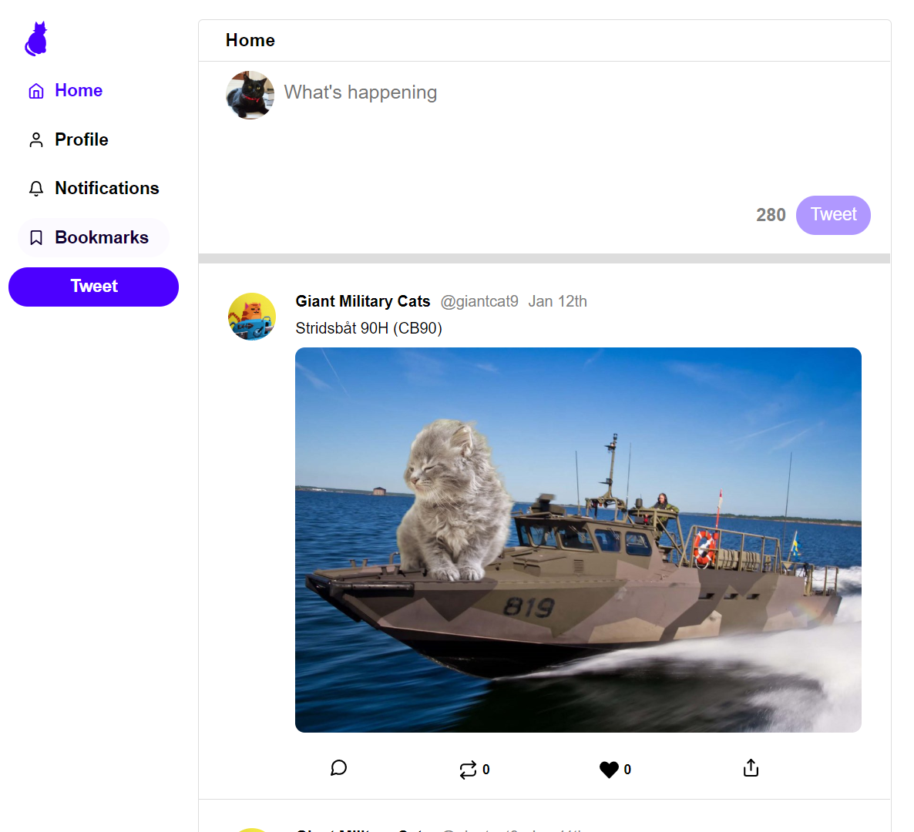
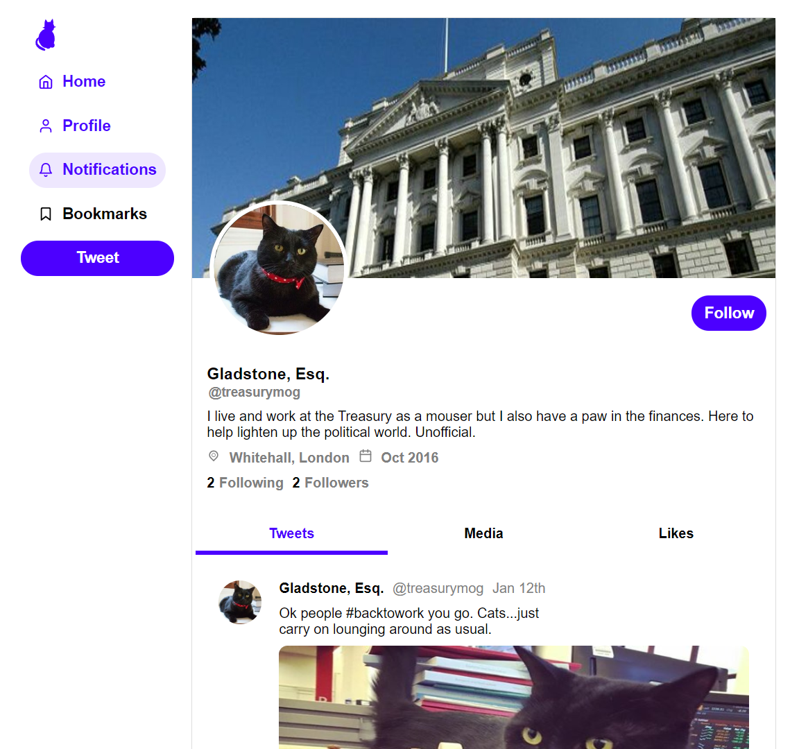

# Twitter Clone for Cats

This is a single user Twitter clone for cats. You can create, like and share tweets. You can view the homefeed, a specific tweet and the profile page of each twitter user.

## TECH STACK

- React
- NodeJS and express

## RUN LOCALLY
```
git clone https://github.com/Charles9869/Twitter-Clone.git
```
## SCREENSHOTS

### HomeFeed



### Tweet page


### Profile page


